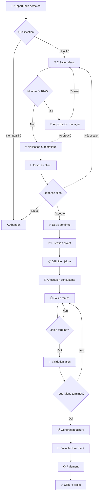
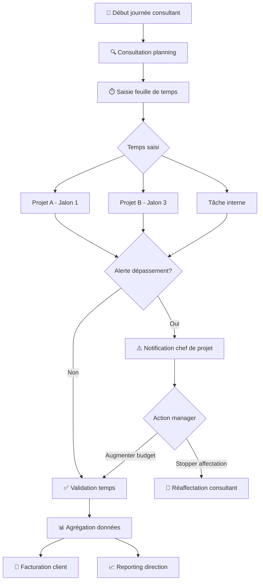
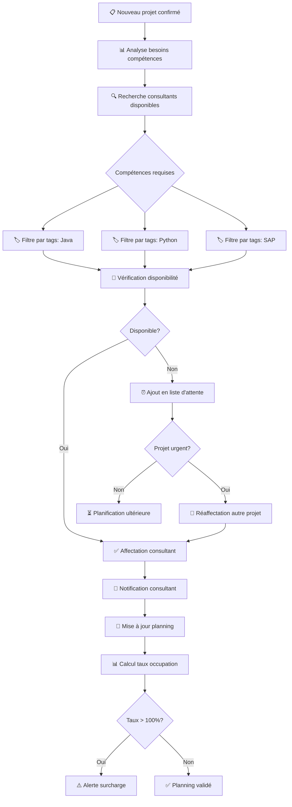
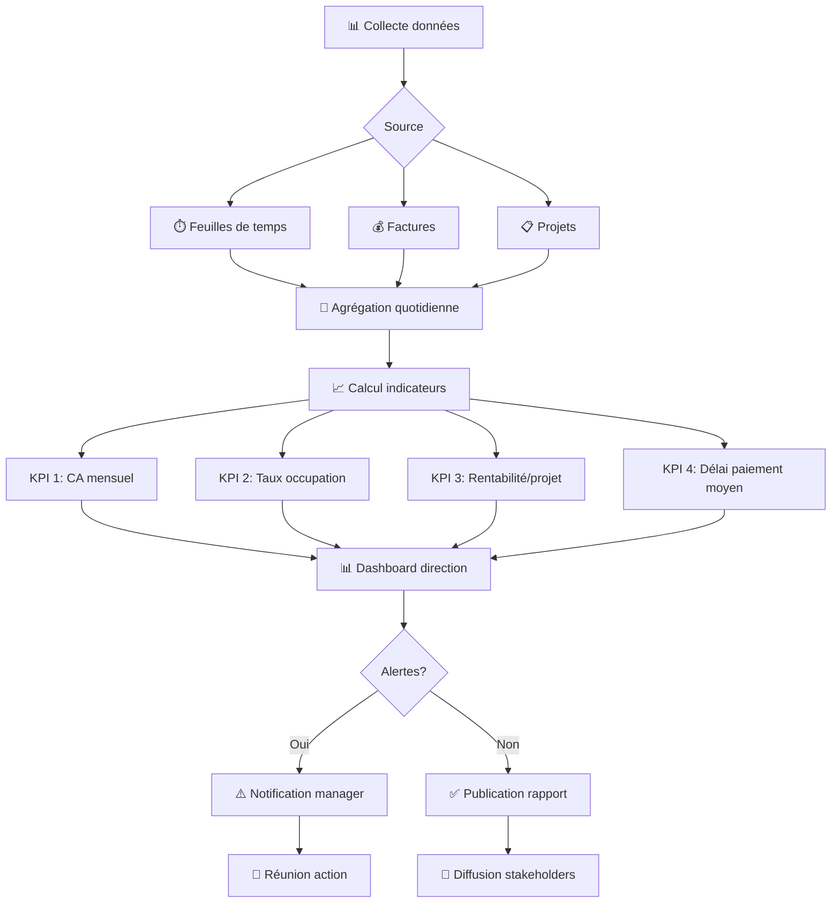

# 📊 Processus Métier - TechServices Pro

## Vue d'ensemble des processus

Ce document présente les principaux processus métier de l'entreprise TechServices Pro et leur implémentation dans Odoo.

---

## 🔄 Processus 1 : Cycle Commercial → Projet → Facturation

### Diagramme de flux

### Acteurs impliqués
- **Commercial** : qualification, création devis
- **Manager** : approbation devis >10k€
- **Chef de projet** : création projet, gestion jalons
- **Consultant** : réalisation, saisie temps
- **Comptable** : facturation, suivi paiements

### Règles de gestion
1. Tout devis >10k€ nécessite validation manager sous 48h
2. Un projet ne peut démarrer que si devis signé
3. La facturation se fait au jalon (livrable terminé + validé)
4. Les consultants doivent saisir leur temps quotidiennement

---

## 🕐 Processus 2 : Gestion du Temps

### Diagramme de flux

### Fréquence
- **Quotidienne** : saisie temps par consultants
- **Hebdomadaire** : revue chef de projet
- **Mensuelle** : facturation et reporting

### Indicateurs clés (KPI)
- Taux de saisie temps J+1 : >95%
- Écart budget/réel par jalon : <10%
- Taux d'occupation consultant : 70-85%

---

## 💰 Processus 3 : Facturation Automatisée

### Diagramme BPMN simplifié

```mermaid
graph LR
    A[⏰ Fin de jalon] --> B{Type contrat?}
    
    B -->|Forfait| C[💵 Facturation 100% jalon]
    B -->|Régie| D[⏱️ Calcul heures réelles]
    
    D --> E[💵 Heures × TJM]
    
    C --> F[📝 Brouillon facture]
    E --> F
    
    F --> G[👁️ Revue comptable]
    G --> H{Corrections?}
    
    H -->|Oui| I[✏️ Ajustements manuels]
    H -->|Non| J[✅ Validation facture]
    
    I --> J
    J --> K[📧 Envoi automatique client]
    K --> L[📆 Échéance paiement]
    
    L --> M{Paiement reçu?}
    M -->|Oui| N[✅ Lettrage]
    M -->|Non J+30| O[📞 Relance niveau 1]
    
    O --> P{Paiement reçu?}
    P -->|Oui| N
    P -->|Non J+15| Q[⚠️ Relance niveau 2]
    
    Q --> R{Paiement reçu?}
    R -->|Oui| N
    R -->|Non| S[🚨 Contentieux]
```

### Automatisations Odoo
1. **Trigger jalon terminé** → génération brouillon facture
2. **J+30 après échéance** → email relance automatique
3. **Validation facture** → mise à jour trésorerie prévisionnelle
4. **Paiement reçu** → lettrage automatique et notification

---

## 👥 Processus 4 : Affectation des Ressources

### Workflow

### Règles d'affectation
- Priorité 1 : Compétence technique requise
- Priorité 2 : Disponibilité immédiate
- Priorité 3 : Historique avec le client (continuité)
- Priorité 4 : Taux d'occupation (équilibrage charge)

### Contraintes
- Un consultant ne peut pas être affecté à >120% sur une semaine
- Les consultants seniors doivent accompagner les juniors (max 2 juniors/senior)
- Rotation tous les 6 mois pour éviter la lassitude

---

## 📈 Processus 5 : Reporting et Pilotage

### Cycle de reporting

### Fréquence des rapports
- **Temps réel** : Dashboard Odoo (consultants, chefs de projet)
- **Quotidien** : Alertes dépassement budget
- **Hebdomadaire** : Rapport avancement projets actifs
- **Mensuel** : Compte de résultat + prévisions
- **Trimestriel** : Revue stratégique direction

---

## 🔑 Points clés d'implémentation Odoo

### Modules standards utilisés
| Processus | Modules Odoo |
|-----------|--------------|
| Commercial → Projet | `sale`, `project`, `sale_project` |
| Gestion temps | `hr_timesheet`, `project_timesheet` |
| Facturation | `account`, `sale_timesheet` |
| Ressources | `hr`, `project_forecast` (Enterprise) ou custom |
| Reporting | `board`, dashboards custom |

### Personnalisations nécessaires
1. **Workflow approbation** : Champs custom + actions serveur (ou Odoo Studio)
2. **Alertes dépassement** : Actions automatiques basées sur règles
3. **Dashboard direction** : Vues personnalisées + graphiques
4. **Calcul rentabilité** : Champs calculés custom dans `project.project`

---

## 🎯 Bénéfices attendus

### Gains de temps
- ⏱️ **-60% temps facturation** : automatisation vs saisie manuelle
- ⏱️ **-40% temps reporting** : dashboards vs Excel
- ⏱️ **-30% temps administratif** : workflows vs emails

### Amélioration pilotage
- 📊 **Visibilité temps réel** sur tous les projets
- 🎯 **Anticipation** des dépassements budgétaires
- 💰 **Optimisation** affectation ressources

### Satisfaction client
- ✅ **Transparence** : accès client au portail projet
- 📧 **Réactivité** : facturation rapide et précise
- 📈 **Qualité** : meilleur respect des délais

---

*Modélisation réalisée par : Consultant Fonctionnel Odoo*  
*Dernière mise à jour : 23 octobre 2025*
