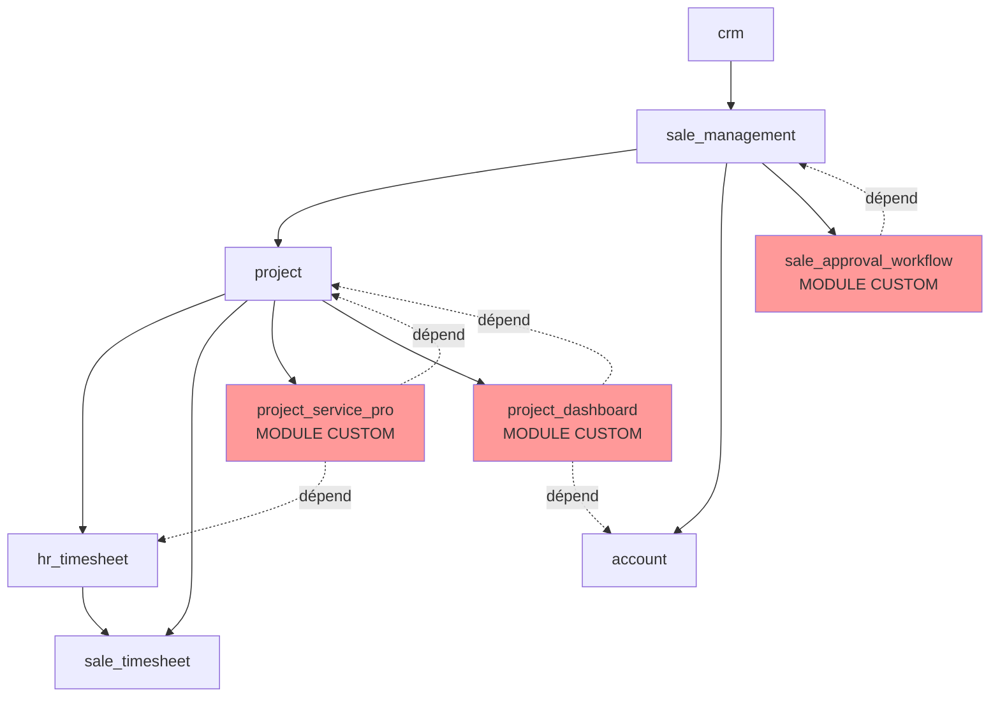

# 🗺️ Mapping Modules Odoo - TechServices Pro

## Vue d'ensemble

Ce document fait le lien entre les besoins métier et les modules Odoo utilisés (standards et custom).

---

## 📊 Tableau de Correspondance

| Besoin Métier | Module Odoo | Édition | % Couverture | Customisation |
|---------------|-------------|---------|--------------|---------------|
| **Gestion opportunités** | `crm` | Community | 95% | Configuration |
| **Création devis** | `sale_management` | Community | 90% | Templates |
| **Gestion projets** | `project` | Community | 85% | Jalons custom |
| **Saisie temps** | `hr_timesheet` | Community | 95% | Minimal |
| **Lien temps-projet** | `project_timesheet` | Community | 90% | Configuration |
| **Facturation** | `account` | Community | 85% | Workflow custom |
| **Facturation temps** | `sale_timesheet` | Community | 80% | Règles calcul |
| **Portail client** | `portal` | Community | 90% | Personnalisation |
| **Workflows** | Module custom | - | 0% | **Développement complet** |
| **Dashboard** | `board` + custom | Community | 60% | **Vues custom** |
| **Planning** | Module custom | - | 0% | **Développement complet** |

---

## 🔧 Modules Standards Odoo

### 1️⃣ CRM (`crm`)
**Version** : Odoo Community 17.0  
**Objectif** : Gestion pipeline commercial

#### Fonctionnalités utilisées
✅ Création opportunités  
✅ Qualification leads  
✅ Étapes pipeline (Nouveau → Qualification → Proposition → Négociation → Gagné/Perdu)  
✅ Activités et rendez-vous  
✅ Historique communications  

#### Configuration nécessaire
- Création étapes personnalisées (optionnel)
- Équipes commerciales (si plusieurs)
- Règles d'attribution automatique (optionnel)

#### Champs custom ajoutés
| Champ | Type | Utilité |
|-------|------|---------|
| `x_project_type` | Selection | Type prestation (Forfait/Régie/Formation) |
| `x_estimated_days` | Integer | Nombre jours estimés |
| `x_technical_skills` | Many2many | Compétences requises (Java, SAP...) |

---

### 2️⃣ Ventes (`sale_management`)
**Version** : Odoo Community 17.0  
**Objectif** : Gestion devis et commandes

#### Fonctionnalités utilisées
✅ Création devis/commandes  
✅ Lignes de commande  
✅ Templates de devis  
✅ Variantes (Forfait vs Régie)  
✅ Génération PDF  
✅ Signature électronique  
✅ Conversion automatique en projet  

#### Configuration nécessaire
- **Templates de devis** :
  - Template "Forfait Projet" (jalons prédéfinis)
  - Template "Régie" (jours × TJM)
- **Conditions de paiement** : 30j fin mois, 45j fin mois
- **Liste de prix** : TJM par niveau (Junior/Confirmé/Senior)

#### Workflow custom
```python
# Ajout dans sale.order
state_approval = fields.Selection([
    ('draft', 'Brouillon'),
    ('pending', 'En attente approbation'),
    ('approved', 'Approuvé'),
    ('sent', 'Envoyé'),
    ('sale', 'Bon de commande'),
    ('cancel', 'Annulé')
])

# Règle : si amount_total > 10000 → passage auto en 'pending'
```

---

### 3️⃣ Projets (`project`)
**Version** : Odoo Community 17.0  
**Objectif** : Gestion projets et tâches

#### Fonctionnalités utilisées
✅ Création projets  
✅ Tâches et sous-tâches  
✅ Affectation utilisateurs  
✅ Dates début/fin  
✅ Kanban, liste, Gantt (si Enterprise)  

#### Limites du module standard
❌ Pas de notion de "jalon" natif → **Développement custom**  
❌ Pas d'alertes dépassement budget → **Actions automatiques custom**  
❌ Calcul rentabilité limité → **Champs calculés custom**  

#### Extension custom : Module `project_milestone`
**Nouveau modèle** : `project.milestone`

| Champ | Type | Description |
|-------|------|-------------|
| `name` | Char | Nom du jalon |
| `project_id` | Many2one | Projet parent |
| `date_start` | Date | Date début |
| `date_end` | Date | Date fin |
| `budget_hours` | Float | Budget heures |
| `amount` | Monetary | Montant facturable |
| `state` | Selection | Statut (à planifier/en cours/terminé...) |
| `user_ids` | Many2many | Consultants assignés |
| `sale_line_id` | Many2one | Ligne de commande liée |

**Calculs automatiques** :
```python
@api.depends('timesheet_ids.unit_amount')
def _compute_hours_consumed(self):
    for milestone in self:
        milestone.hours_consumed = sum(milestone.timesheet_ids.mapped('unit_amount'))
        
@api.depends('hours_consumed', 'budget_hours')
def _compute_progress(self):
    for milestone in self:
        milestone.progress = (milestone.hours_consumed / milestone.budget_hours * 100) if milestone.budget_hours else 0
```

---

### 4️⃣ Feuilles de Temps (`hr_timesheet`)
**Version** : Odoo Community 17.0  
**Objectif** : Suivi temps consultants

#### Fonctionnalités utilisées
✅ Saisie lignes de temps  
✅ Lien Project/Task  
✅ Validation manager  
✅ Vue grille (semaine)  
✅ Timer intégré  

#### Configuration
- **Unité** : Heures (par défaut)
- **Période de saisie** : J-7 à J+2
- **Validation** : Hebdomadaire obligatoire

#### Champs custom ajoutés
| Champ | Type | Utilité |
|-------|------|---------|
| `x_milestone_id` | Many2one | Lien vers jalon (si pas tâche) |
| `x_type` | Selection | Projet/Interne/Formation/Commercial |
| `x_validated` | Boolean | Validé par chef projet |
| `x_validated_date` | Datetime | Date validation |

---

### 5️⃣ Comptabilité (`account`)
**Version** : Odoo Community 17.0  
**Objectif** : Facturation et finance

#### Fonctionnalités utilisées
✅ Création factures  
✅ Lignes de facture  
✅ Taxes  
✅ Paiements  
✅ Lettrage  
✅ Relances  

#### Automatisations custom
**Génération facture depuis jalon** :
```python
# Action serveur déclenchée manuellement ou auto
def action_create_invoice(self):
    # self = project.milestone
    invoice = self.env['account.move'].create({
        'move_type': 'out_invoice',
        'partner_id': self.project_id.partner_id.id,
        'invoice_date': fields.Date.today(),
        'invoice_line_ids': [(0, 0, {
            'name': f'{self.project_id.name} - {self.name}',
            'quantity': self.hours_consumed if self.project_id.pricing_type == 'timesheet' else 1,
            'price_unit': self.compute_unit_price(),
        })]
    })
    self.write({'state': 'invoiced', 'invoice_id': invoice.id})
```

**Relances automatiques** :
- Action planifiée quotidienne
- Si `invoice.payment_state == 'not_paid'` ET `date_due + 30 jours`
- Envoi email template "Relance niveau 1"

---

### 6️⃣ Facturation Temps (`sale_timesheet`)
**Version** : Odoo Community 17.0  
**Objectif** : Lien vente-projet-facturation

#### Fonctionnalités utilisées
✅ Service "Temps passé sur tâche"  
✅ Création projet depuis commande  
✅ Calcul automatique montant selon temps  

#### Configuration
- **Type de service** : "Feuilles de temps sur tâches"
- **Politique facturation** : "Quantités livrées (manuel)" ou "Jalons"

---

## 🛠️ Modules Custom Développés

### Module 1 : `project_service_pro`
**Objectif** : Extensions pour gestion services professionnels

#### Modèles ajoutés
1. **`project.milestone`** : Jalons de projet
2. **`project.milestone.type`** : Types de jalons (Analyse, Dev, Recette...)
3. **`project.budget.alert`** : Historique alertes dépassement

#### Vues ajoutées
- Vue formulaire jalon
- Vue liste jalons (avec indicateurs)
- Vue Kanban jalons
- Vue calendrier jalons (planning)
- Dashboard chef de projet

#### Workflows
- Validation jalons (draft → en cours → terminé → validé → facturé)
- Alertes automatiques (mail + notification)

#### Rapports
- Rapport avancement projet (PDF)
- Analyse rentabilité (XLS)

---

### Module 2 : `sale_approval_workflow`
**Objectif** : Workflow d'approbation devis

#### Modification modèle
Extension de `sale.order` :

| Champ | Type | Description |
|-------|------|-------------|
| `approval_state` | Selection | draft/pending/approved/rejected |
| `approver_id` | Many2one(res.users) | Manager approbateur |
| `approval_date` | Datetime | Date approbation |
| `rejection_reason` | Text | Raison refus |

#### Boutons d'action
- `action_request_approval()` : Demande approbation
- `action_approve()` : Approuver (manager seulement)
- `action_reject()` : Refuser

#### Règles de sécurité
```xml
<record id="rule_approve_quotes" model="ir.rule">
    <field name="name">Managers can approve quotes</field>
    <field name="model_id" ref="sale.model_sale_order"/>
    <field name="groups" eval="[(4, ref('sales_team.group_sale_manager'))]"/>
    <field name="perm_write" eval="True"/>
</record>
```

---

### Module 3 : `project_dashboard`
**Objectif** : Tableaux de bord personnalisés

#### Dashboards créés
1. **Dashboard Chef de Projet** (`project_manager_dashboard`)
   - Mes projets actifs
   - Projets en alerte
   - Graphique consommation budget
   
2. **Dashboard Direction** (`director_dashboard`)
   - KPI globaux (CA, taux occupation)
   - Top clients
   - Projets en dépassement
   - Prévisionnel CA

#### Technologies
- Actions de fenêtre custom
- Vues QWeb pour graphiques
- Librairie Chart.js (intégrée Odoo)

---

## 📈 Architecture des Dépendances



---

## 🔄 Ordre d'Installation

### Phase 1 : Modules standards
1. `crm`
2. `sale_management`
3. `project`
4. `hr_timesheet`
5. `account`
6. `sale_timesheet`
7. `portal`

### Phase 2 : Configuration
- Créer équipes commerciales
- Paramétrer listes de prix
- Créer templates de devis
- Configurer conditions de paiement

### Phase 3 : Modules custom
1. `project_service_pro` (dépend de project, hr_timesheet)
2. `sale_approval_workflow` (dépend de sale_management)
3. `project_dashboard` (dépend de project, account)

### Phase 4 : Données de démo
- Importer clients
- Créer utilisateurs tests
- Générer projets exemples

---

## 📋 Checklist de Validation

### Par module
- [ ] `crm` : Pipeline configuré, opportunité test créée
- [ ] `sale_management` : Devis test créé avec template
- [ ] `project` : Projet test avec tâches
- [ ] `hr_timesheet` : Temps saisi et validé
- [ ] `account` : Facture générée et envoyée
- [ ] `sale_timesheet` : Temps facturé correctement
- [ ] `project_service_pro` : Jalon créé, alerte déclenchée
- [ ] `sale_approval_workflow` : Workflow approbation testé
- [ ] `project_dashboard` : Dashboards affichent données

---

## 📚 Documentation Technique

### Ressources Odoo
- [Documentation officielle Odoo 17](https://www.odoo.com/documentation/17.0/)
- [Modules standards Community](https://github.com/odoo/odoo/tree/17.0/addons)
- [OCA - Odoo Community Association](https://github.com/OCA)

### Bonnes pratiques
- ✅ Hériter des modèles existants plutôt que créer de zéro
- ✅ Utiliser `_inherit` pour extensions légères
- ✅ Préfixer champs custom par `x_` (ou nom module)
- ✅ Créer vues héritées plutôt que remplacer
- ✅ Documenter workflows dans `__manifest__.py`

---

*Document technique rédigé par : Consultant Fonctionnel Odoo*  
*Dernière mise à jour : 23 octobre 2025*
